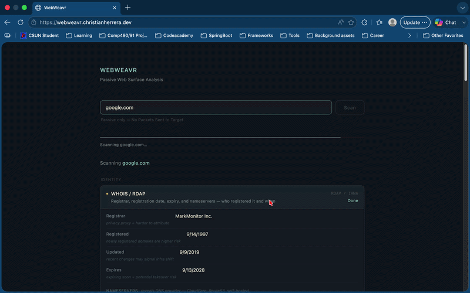

# WebWeavr

A passive reconnaissance tool that scans a domain across multiple OSINT sources and streams results in real time via Server-Sent Events (SSE).



## Tech Stack

- **Runtime:** Node.js (ES Modules)
- **Framework:** Express 5
- **Database:** MySQL (mysql2)
- **Validation:** Zod
- **Security:** Helmet, CORS, rate limiting (express-rate-limit)
- **Streaming:** Server-Sent Events (SSE)
- **Logging:** Morgan (combined)
- **Deployment:** Docker, Docker Compose, Nginx

## Features

- Runs recon modules in parallel across 4 categories
- Streams live progress updates to the client via SSE
- Aggregates subdomains, resolves live hosts, and enriches results through a post-scan pipeline
- Logs all scans to MySQL for audit history (queryable directly via the database)

## Recon Modules

| Category | Modules |
|---|---|
| Identity | WHOIS / RDAP |
| Infrastructure | DNS Records, BGP / ASN, IPInfo, InternetDB |
| Subdomains | crt.sh, CertSpotter, Anubis |
| Historical Exposure | Wayback Machine, CommonCrawl, URLScan |

## Project Structure

```
WebWeavr/
├── config/
│   ├── db.js               # MySQL connection pool
│   ├── modules.js          # Module registry and group definitions
│   └── validateEnv.js      # Zod environment variable validation
├── controllers/
│   └── reconController.js  # SSE scan endpoint handler
├── middleware/
│   └── errorHandler.js     # Global error handler
├── modules/                # Individual OSINT source modules
├── pipeline/
│   ├── aggregate.js        # Deduplicate and collect subdomains
│   ├── resolve.js          # DNS resolution to find live hosts
│   └── enrich.js           # Enrich live hosts with org, geo, and port data
├── repositories/
│   └── scansRepository.js  # All database queries — single source of SQL
├── routes/
│   ├── index.js            # Root router — mounts all route groups
│   └── recon.js            # /api/recon routes
├── schema/
│   └── schema.sql          # Database schema
├── services/
│   ├── reconService.js     # Orchestrates modules and pipeline
│   └── scanLogger.js       # Writes scan records to MySQL
├── utils/
│   ├── domain.js           # Domain validation
│   └── sse.js              # SSE helper
├── public/                 # Frontend (HTML, CSS, JS)
├── Dockerfile              # API container build
├── docker-compose.yml      # API + MySQL stack
├── app.js                  # Express app setup
└── index.js                # Server entry point
```

## Getting Started

### Option A: Docker (recommended)

```bash
docker compose up -d
```

This brings up both the API and MySQL with the schema pre-loaded. The app will be available on `http://localhost:3001`.

### Option B: Local Node + MySQL

#### 1. Install dependencies
```bash
npm install
```

#### 2. Configure environment variables

Create a `.env` file in the project root:
```
DB_HOST=localhost
DB_USER=webweavr
DB_PASSWORD=yourpassword
DB_ROOT_PASSWORD=yourrootpassword
DB_NAME=webweavr_recon
CORS_ORIGIN=https://yourdomain.com
PORT=3000
```

#### 3. Set up the database
```bash
mysql -u root -p < schema/schema.sql
```

#### 4. Start the server
```bash
# Development
npm run dev

# Production
npm start
```

## API

### `GET /api/recon?domain=<domain>`

Streams scan progress as Server-Sent Events.

**Event types:**

| Event | Description |
|---|---|
| `start` | Scan initiated, total module count |
| `module_start` | A module has begun |
| `module_done` | A module completed with results |
| `module_error` | A module failed |
| `pipeline_start` | Post-scan pipeline is running |
| `pipeline_done` | Final enriched results |
| `complete` | Scan finished |

## Data Flow

```
GET /api/recon?domain=
        ↓
  reconController
        ↓
  reconService (runs all modules in parallel)
        ↓
  pipeline: aggregate → resolve → enrich
        ↓
  SSE stream → client
        ↓
  scanLogger → scansRepository → MySQL
```

## Security

- Helmet with strict CSP and `frame-ancestors 'none'`
- CORS scoped to a single origin, GET-only, no credentials
- Rate limiting (3 requests / 15 min per IP)
- Request body size cap (10kb)
- Zod-validated environment variables
- Parameterized SQL queries, isolated to the repository layer
- Docker container runs as non-root with isolated network and resource limits
- Generic 500 responses (no stack trace leakage)

## Scripts

| Command | Description |
|---|---|
| `npm run dev` | Start with nodemon |
| `npm start` | Start with node |
